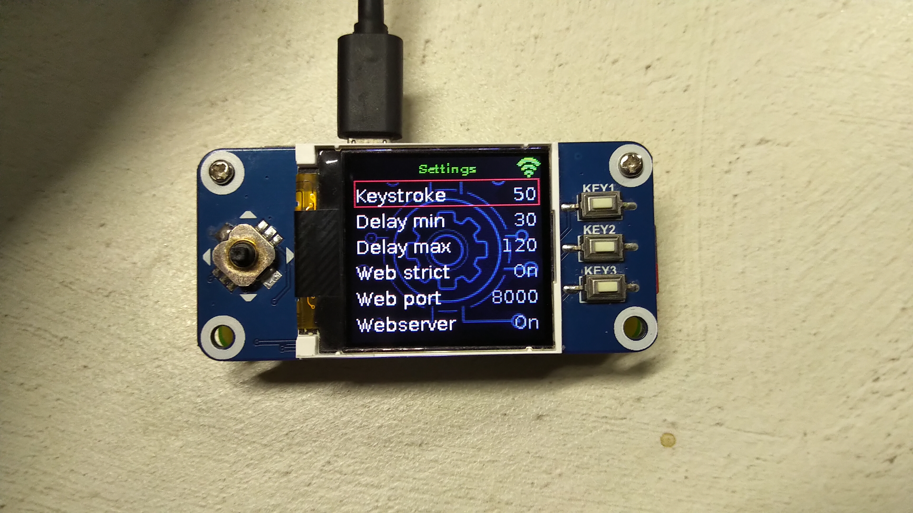

# Password PI

This project is a hardware password manager. It acts as a keyboard emulator for the host machine and sends the password as keyboard strokes.

## Hardware requirements

 - Raspberry PI Zero W: https://www.raspberrypi.org/products/raspberry-pi-zero-w/
 - Waveshare display with keyboards: https://www.waveshare.com/product/raspberry-pi/displays/lcd-oled/1.44inch-lcd-hat.htm

## Software requirements and dependencies

  - Raspbian OS (Ubuntu-based)
  - Java 8 SDK
  - PI4J library (https://pi4j.com/1.2/index.html)
  - JDI dependency injection library (https://github.com/szabogabriel/JDI)
  - jMustache templating library (https://github.com/szabogabriel/jMustache)
  - Waveshare 1.44 inch LCD hat driver (https://github.com/szabogabriel/1.44inch_LCD_Hat_Java)

## Current functionalities and limitations

  - Sending of the keystrokes is implemented. Currently only the english keyboard layout is supported. From the splash screen use the joystick to activate the accounts view and use the joystick center button to send the associated password to the keyboard. A randomized keystroke interval is present as well.
  

  
  - Runtime configuration with the exception of the account management can be performed via the controls available on the device. Settings is activated via the 'C' key. Navigate and set values via the joystick. Account management is planned to be activated via the 'B' key.
  

  
  - Turning off the display is possible via the 'A' key.
  
  - Persistence is currently done via property files.
  
  - The master password locking is only prepared but not tested. It also doesn't encrypt the password vault in its current implementation.
  
  - Web interface is implemented. It can be activated directly on the device and also approval of all the requests and changes performed via the web interface.
  

## Implementation details

The programming language used is Java 8. It was tested on OpenJDK.

Most of the dependencies are minimalistic libraries available in my github account. The HAT driver especially needs some fine tuning (double buffering is present, but multithreaded notification would be needed to omit unnecessary updates).

The Password PI itself is currently also in an early phase. The basic functionalities are implemented, but still a lot of them is missing and there are some rough edges in the code as well.

The package structure resembles a Spring Boot application. The biggest difference is in the dependency injection framework (JDI), which relies on a configuration service instead of annotations. Otherwise most of the functionalities are abstracted via an interface. An effort was made to remove static references and use dependency injection via the constructor (the only one available in the JDI library). Since no value injection is available, those were injected via the configuration service.

There are two types of configuration present in the system. Runtime configuration is configurable via the `runtime.properties` file. These are mainly technical values used mainly by the dependency injection library. This is available either directly via the `RuntimeConfig` enum or via the `JdiConfigService` class. The second type of configuration are the settings available via the HAT or the web interface for the user to be changed. These settings are managed via the `SettingsService` service class.

The GUI is according to the MVC pattern. However, every component describes the whole screen, not just the smaller parts, like for example a text field, or a button. The main reason for this was the absence of a GUI framework to be used. AWT and Swing were problematic. It would require a custom display implementation, which would be then set via an environment variable. However, since the LCD HAT mock also uses Swing, it needs access to the OS-native display implementation. Apache Pivot was also promising, but then I decided to create my own simple framework. This later on proved to be the correct way, since "classic" GUI framework would consume most of the display's resolution (128x128) for borders and paddings. The current framework is basically a simple menu-system with background images. It enables simple editing (boolean and numeric values). The two biggest points currently missing are the text input and text scrolling.

The web interface is done via the HTTP server implementation available directly in the JDK. It is a simple but effective implementation with low memory and CPU footprint. It requires lower level development (e.g. manually parsing the FORM post data). It uses Mustache templates and caches every resource (css, js, jpeg etc.) in memory. Currently it is around 640kB, so it is safe to do so. Switching to HTTPS would be possible (and necessary), but not yet done. However, since all the changes must be approved on the device, it is still safe to leave it currently as is. Also, currently no password is sent to the frontend.

## Known issues with the system

  - The GUI is sometimes not refreshed correctly. This is due to the "optimization" of the double buffering mechanism in the LCD HAT library. It enabled to reduce the CPU load from 80-85% to about 1% idle, but the price was, that some changes are missed.
  
  - The code on some part is a bit messy (especially the web interface part). A nice refactoring would be beneficial.

## Future TODOs

  - Use master password to encrypt the stored passwords and lock the application.

  - HTTPS support.
  
  - Extend the GUI editing functionalities available on the device thus enabling offline password management.
  
  - Database instead of properties files.
  
  - Optimize the 3rd party libraries (LCD HAT, Mustache, JDI).
  
  - Extend web functionalities (check for updates, save and download files, accept push notifications).
  
  - REST interface. This would be a nice to have for changing the keyboard layout automatically.
  
  - Add keepass support. There is a Java binding for the KeePass available.
  
  - Add WiFi management via the device. Currently the Raspberry PI must be connected to the WiFi to be able to use it. No management via the device is possible.
  
  - Create a nice case for the device.
  
## Development environment

I used Eclipse to build this app. No special tools were necessary. The LCD HAT mock provides a convenient way of working, without the need to deploy the application to the Raspberry PI device all the time. As for build, a Ant `build.xml` is present to generate a single jar file and a `deploy.sh` is also available, which deploys it. Feel free to use it.
